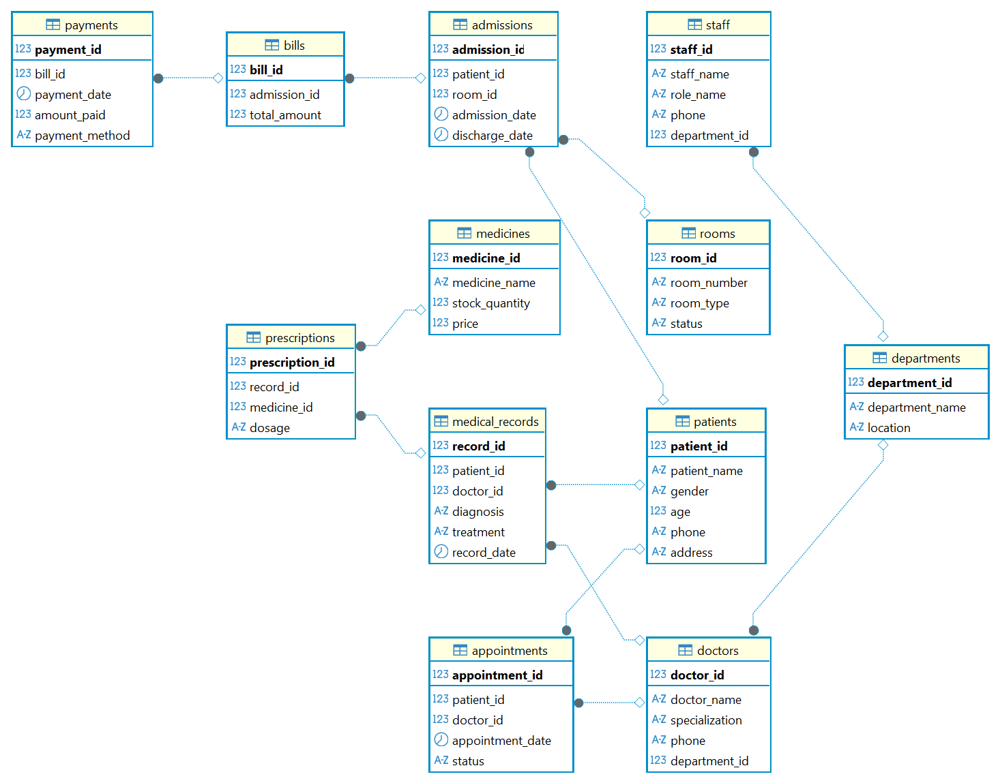
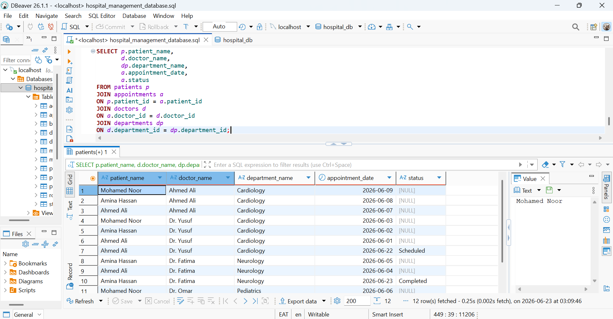
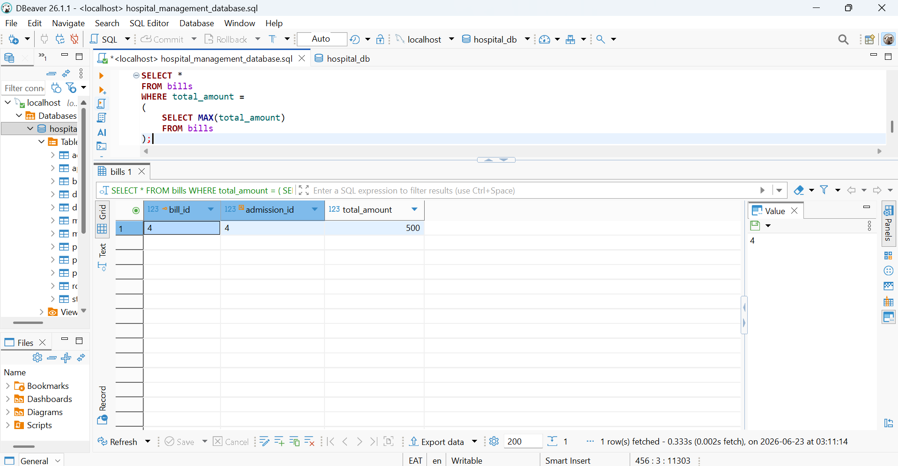
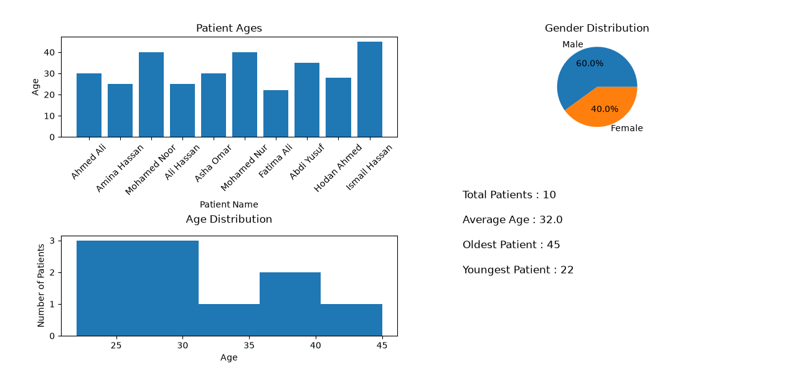

# 🏥 Hospital Management Database & Analytics Dashboard

## 📌 Project Overview

This project is a **Hospital Management Database and Analytics Dashboard** built using **MySQL, SQL, and Python**.

The project demonstrates database design, SQL querying, Python integration, data analysis, Excel export, and data visualization. It provides a complete workflow from storing hospital data in a relational database to analyzing and presenting insights through charts and dashboards.

---

# 🚀 Project Features

### Database Features

- Relational Database Design
- Primary Keys & Foreign Keys
- SQL Table Creation
- Data Insertion
- Data Retrieval
- SQL Reporting Queries

### Python Analytics Features

- Connect Python to MySQL Database
- Execute SQL Queries using Python
- Load SQL data into Pandas DataFrames
- Analyze Patient Data
- Export Query Results to Excel
- Generate Charts using Matplotlib
- Build an Analytics Dashboard

---

# 🛠 Technologies Used

- Python
- MySQL
- SQL
- Pandas
- Matplotlib
- OpenPyXL
- MySQL Connector
- DBeaver
- GitHub

---

# 🗂 Database Structure

The database contains the following tables:

1. Patients
2. Doctors
3. Departments
4. Appointments
5. Medical Records
6. Prescriptions
7. Medicines
8. Admissions
9. Rooms
10. Bills
11. Payments
12. Staff

---

# 💻 SQL Skills Demonstrated

- CREATE DATABASE
- CREATE TABLE
- INSERT INTO
- SELECT
- WHERE
- ORDER BY
- GROUP BY
- HAVING
- COUNT
- SUM
- AVG
- MIN
- MAX
- INNER JOIN
- LEFT JOIN
- RIGHT JOIN
- Subqueries
- Aggregate Functions
- String Functions
- Date Functions

---

# 🐍 Python Skills Demonstrated

- mysql.connector
- pandas.read_sql()
- DataFrames
- Data Analysis
- Excel Export
- Matplotlib Charts
- Dashboard Development
- Statistics Calculation

---

# 📊 Dashboard Features

The Python dashboard includes:

- 📈 Patient Age Bar Chart
- 🥧 Gender Distribution Pie Chart
- 📉 Age Distribution Histogram
- 📋 Statistics Panel

Dashboard Statistics:

- Total Patients
- Average Age
- Oldest Patient
- Youngest Patient

---

# 📷 Project Screenshots

## ER Diagram



---

## SQL Query Examples

### Aggregate Functions


### String Functions


### Date Functions


### JOIN Operations



### Subqueries



### GROUP BY / HAVING / ORDER BY


---

## Python Dashboard

> Upload the generated dashboard image as **hospital_dashboard.png**



---

# 📁 Project Files

Database Files

- hospital_management_database.sql
- dump-hospital_db-202606230206.sql

Python Files

- hospital_patients.py
- hospital_charts.py
- hospital_dashboard.py

Generated Files

- patients.xlsx
- patient_age_chart.png
- gender_chart.png
- hospital_dashboard.png

Documentation

- README.md
- ER_Diagram.png

---

# ▶ How to Run

## Clone Repository

```bash
git clone https://github.com/Abdisamad-Kasim/Hospital-Management-Database.git
```

Install Required Libraries

```bash
pip install pandas matplotlib mysql-connector-python openpyxl
```

Run Dashboard

```bash
py hospital_dashboard.py
```

---

# 📈 Project Outcomes

This project demonstrates the ability to:

- Design relational databases
- Write advanced SQL queries
- Connect Python with MySQL
- Analyze data using Pandas
- Export data to Excel
- Build analytical dashboards
- Visualize data using Matplotlib

---

# 🔄 Latest Update (June 2026)

### New Python Analytics Module Added

New Features:

- Python connected with MySQL
- SQL Queries executed from Python
- Pandas Data Analysis
- Excel Export
- Bar Chart
- Pie Chart
- Histogram
- Patient Statistics Dashboard

---

# 👨‍💻 Author

**Abdisamad Kasim Ahmed**

### LinkedIn

https://www.linkedin.com/in/abdisamad-ahmed-b53551219

### GitHub

https://github.com/Abdisamad-Kasim

---

## ⭐ If you found this project useful, please consider giving it a Star.
